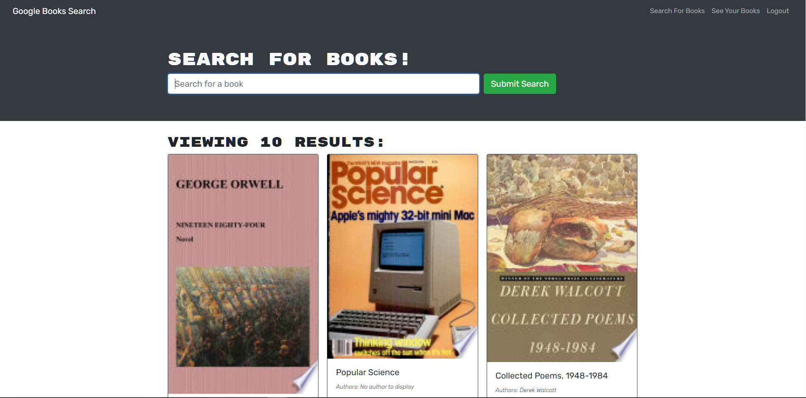

# Book Search Engine

## Licence

[](https://opensource.org/licenses/MIT)

## Table of Contents

- [Description](#Description)
- [Links](#Links) 
- [Installation](#Installation)
- [Usage](#Usage)
- [Testing](#Testing)
- [Credits](#Credits)
- [Questions](#Questions)

## Description



<br>

I'll be building a using the MERN stack, with a React front end, MongoDB database, and Node.js/Express.js server and API. It's already set up to allow users to save book searches to the back end.

AS AN avid reader
I WANT to search for new books to read
SO THAT I can keep a list of books to purchase

## Links

  <a href="https://afternoon-hamlet-49853.herokuapp.com/">Deployed</a>
  <br>


## Installation

1. Clone the starter code.
2. Install and/or require packages.
3. Modify the code based on the Acceptance criteria.
4. Full fill the acceptances criteria grading requirements.
5. Add, Commit, and Push Repo to Heroku.
6. Follow the instructions to submit the Challenge for review.

## Usage

The challenge a application that uses an Apollo Server and apply it to the Express.js server as middleware. Additionally, featuring a book’s title, author, description, image, and a link to that book on the Google Books site. The application will also a fully functioning Google Books API search engine built with a RESTful API, and refactor it to be a GraphQL API built with Apollo Server. 

## Testing
```
1. npm i - to install npm
2. npm run seed
3. npm develop - Start both client and server concurrently
4. npm start - Start server and cilent
5. npm run build - Build client only

```
## Credits 
Instructor, 2u Tutor and TA.

## Questions

GitHub Username: BrownCAB
<br>E-mail: brown.calah@hotmail.com 
<br>Contact: E-mail
